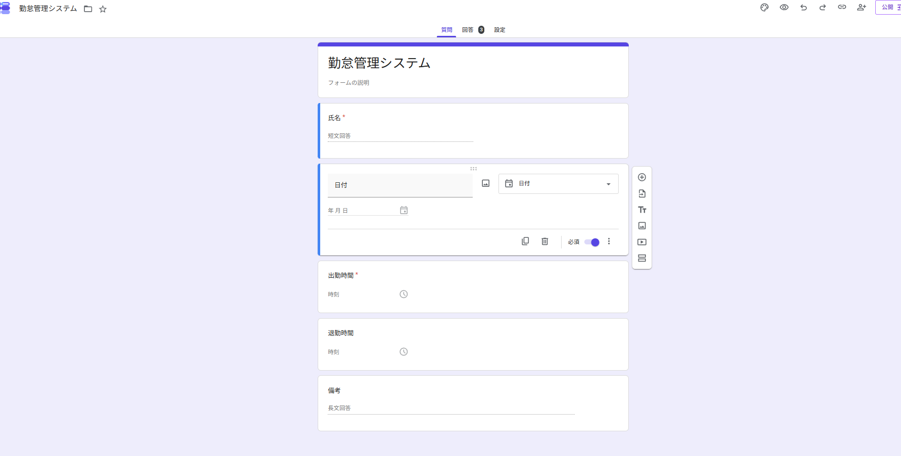
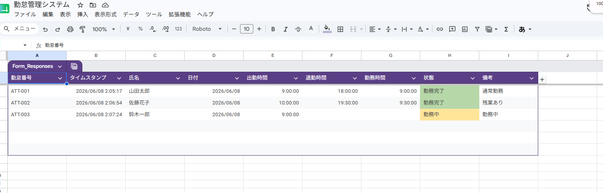
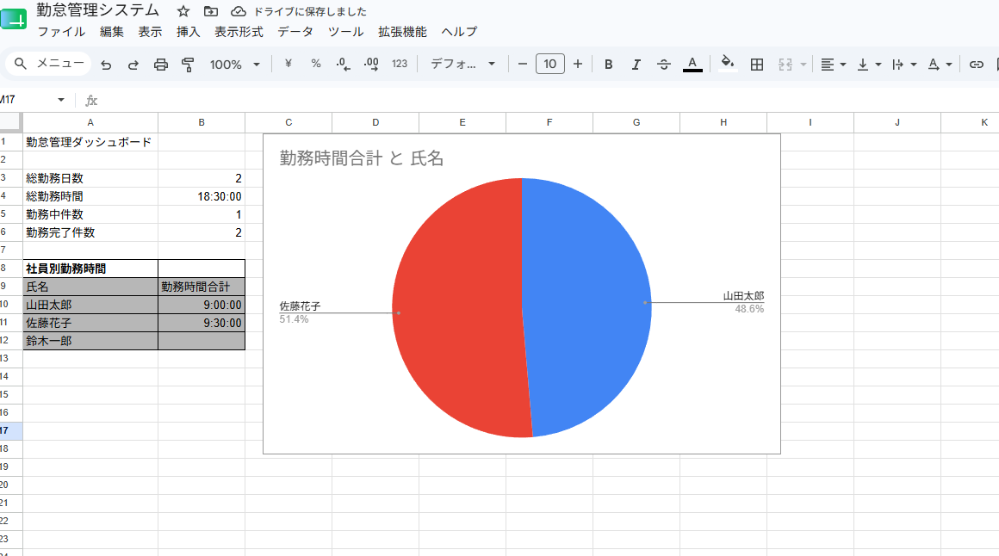

# 勤怠管理システム

Googleフォーム・Googleスプレッドシート・Google Apps Script（GAS）を使用して作成した勤怠管理システムです。

フォームから入力された勤怠情報を自動で記録し、勤務時間の集計やダッシュボード表示を行う学習用ポートフォリオです。

## 概要

フォームから入力された勤怠情報を自動で記録し、勤務時間の集計やダッシュボード表示を行う学習用ポートフォリオです。

## 主な機能

- Googleフォーム入力
- 勤怠データ自動保存
- 勤務時間自動計算
- 勤怠集計
- ダッシュボード表示

## 使用技術

- Googleフォーム
- Googleスプレッドシート
- Google Apps Script（GAS）

## 工夫した点

- 勤務時間を自動計算
- フォーム入力のみで記録可能
- 集計シートで管理しやすい構成
- ダッシュボードで可視化

## 作成目的

勤怠管理業務の基本的な流れを理解するために作成しました。

## 今後の改善案

- 残業時間計算
- 遅刻・早退判定
- Slack通知
- 月別レポート作成
## 画面イメージ

### 勤怠入力フォーム

### 勤怠管理シート

### ダッシュボード

